

  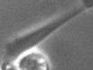
  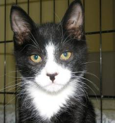
  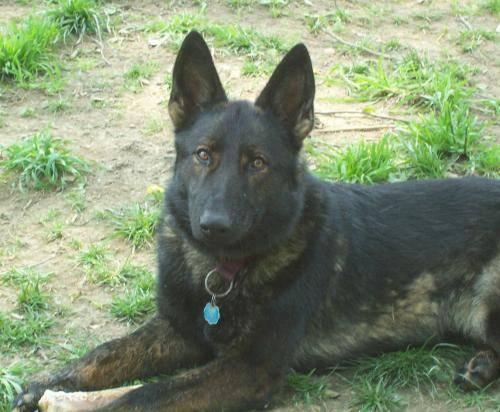
  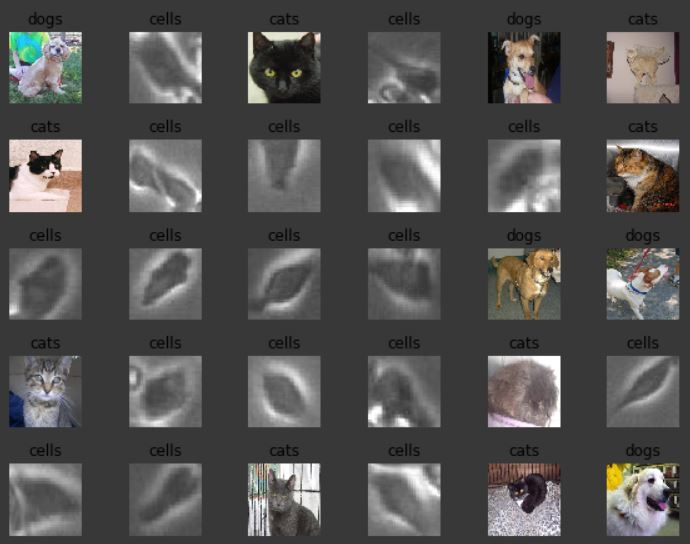

This project started out with obtaining the dataset of cell images. This was made possible through the use of HNU Photonics' biochip, which is a small container containg a sample of cells with the intention of observing their reaction to certain environments. It was later established that this technology could be used to observe the reaction of cells to certain types of cancer treatment. With HNU providing the hardware, I along with AlgorithmHub set out to design a software that could be given the images and in turn, provide a count on the number of healthy cells that were present.Another goal for this project was to get the machine learning model to a state where it could record the varying level of healthy cells over a period of time and return a line graph based off of this change in the cell count. 

As I designed the neural net, I encountered several obstacles along the way. Some of them were easily solvable and only involved a change in the syntax, others involved some level of creativity and intuition. My first issue being that even though image identification is relatively easy for a neural net to do, object detection is quite a bit more difficult. To fix this, I used the labellmg tool to draw bounding boxes over each of the healthy cells and the pascal VOC-to-Images python tool to turn each of those bounding boxes into it's own separate image. The idea here was to train the neural net on these smaller single cell images with the intention of adapting the neural net to identify the cells in whole pictures later. The results of deriving images from my labelling can be seen below. 

  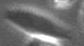
  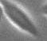
  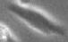
  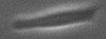
  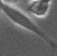
  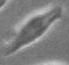
  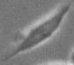
  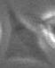

The next obstacle faced was that even after my neural net was trained on images of cells, when tested on random images of dogs and cats, it still identified them as cells. To remedy this, I decided to train my neural on not just images of cells, but dogs and cats as well. The reasoning behind this was based on the idea that because the neural net was only being trained on cells, it thought everything was a cell. If it was given examples as to what a dog or cat looked like, the neural net, in theory, should be able to derive a more specific picture of what cells and only cells look like. As to whether or not my theory proved true can not be said, as my neural net still identified everything as a cell after introducing cats and dogs to the pipeline. It wasn't till I switched up the syntax and corrected my label map did I finally get a neural net that provided the following result:

