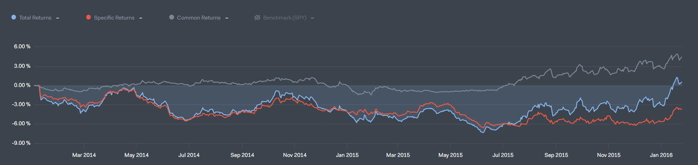

Quantopian is a crowd-sourced hedge fund that provides an IPython Notebook platform for the purpose of quantitative analysis and the development of trading algorithms in order to buy and sell securities. Quantopian also provides a backtesting function which allows for the observance of how well an algorithm will do when tested against previously existing stock trends. 

