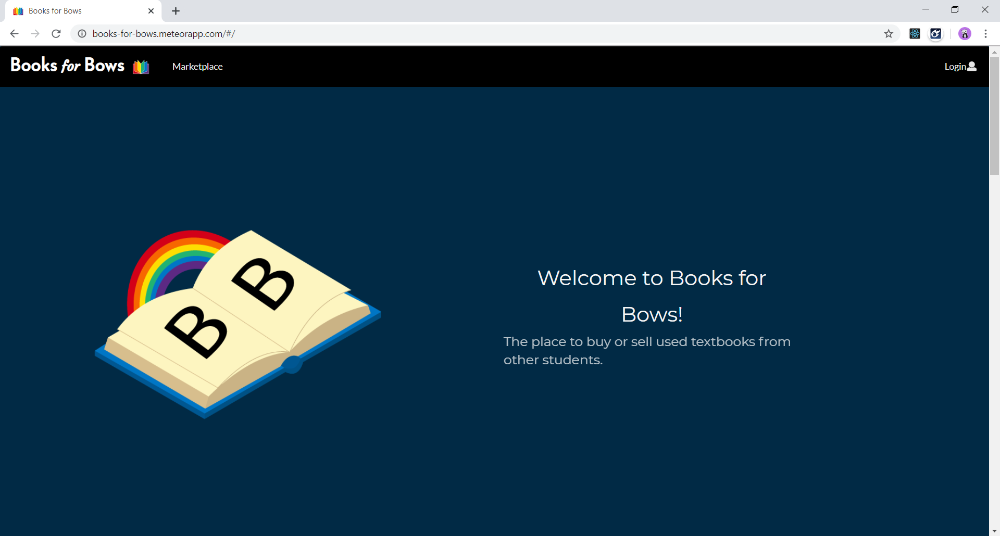
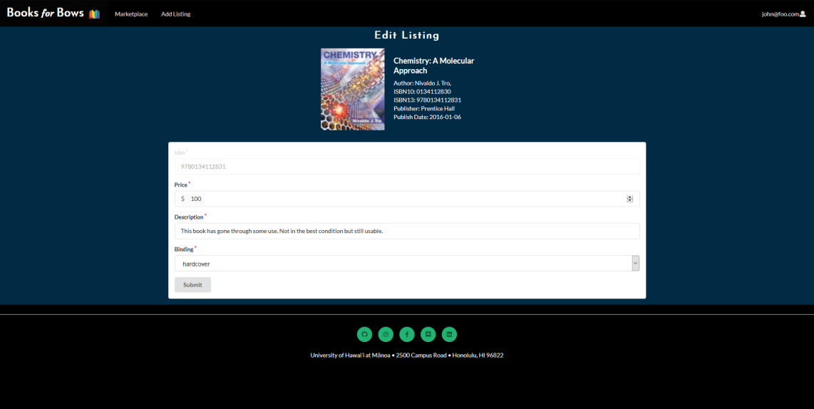
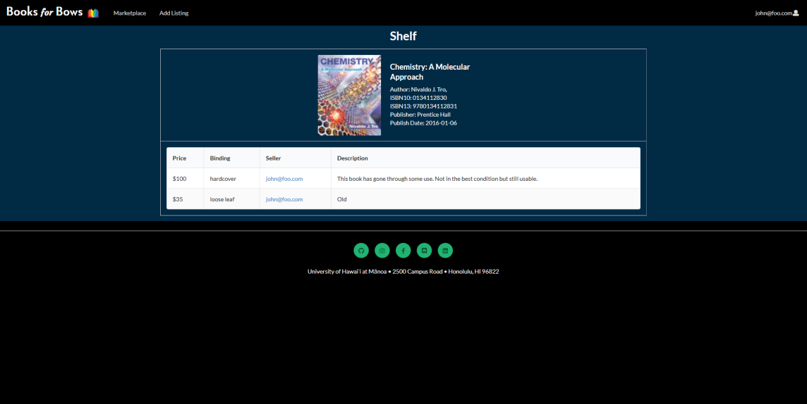

At the end of my software engineering course, my group and I were assigned a project that would use a culmination of all the skills we acquired over the duration of this course. By taking our knowledge of rendering web pages, routing services, and API integration, we were able to develop a website intended for students to easily buy and sell books between each other. This site was developed for University of Hawai'i students and was called Books for Bows. 

As we assigned which roles would go to which team partners, it was important that we consider what particular skills each of us excelled in the most. When referring to myself, I brought a considerable level of experience when it came to taking new components and adapting it to fit our specific objective. In the case of books for bows, this allowed for me to explore the implementation of a search engine. 

Rendering this particular feature for the app did come with a host of challenges, one of the most frustrating being getting the search engine to pull from the default data within the collections. A lot of the troubleshooting took the shape of ironing out the purposes for each variable and function involved in building the search engine component. 

Once rendered and integrated with my fellow team mate's contributions, the site was now at full functionality. This of course allowing the user with the ability to add and edit listings:

We also decided to incorporate a 'shelf' feature. This basically served as page to share extra information on the specific title selected. If the user decided to search via ISBN number, they would also be able to access a considerable amount of information that the website pulled from the Google Books API. 

All of our soucre code for this project can be accessed, right [here.](https://github.com/books-for-bows)

