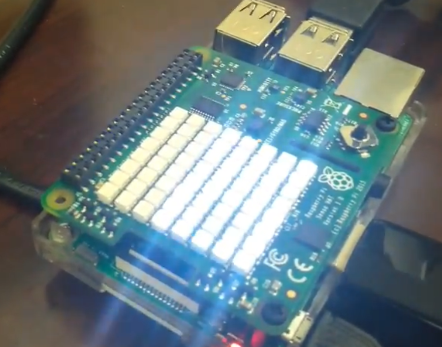
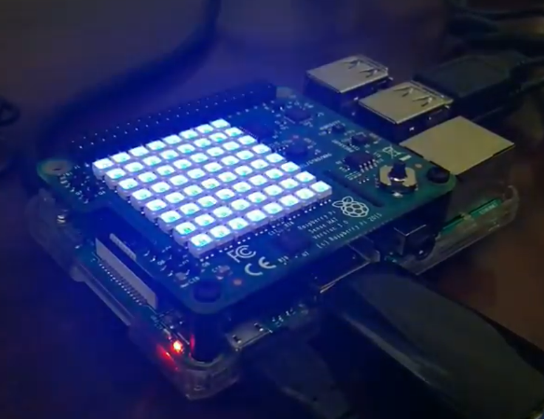

With the assistance of amazing technologies like the Amazon Alexa and the AWS platform, I set about designing an Amazon skill that could automate devices within the home. The idea would be that a basic command would be given to the Amazon Alexa to perform, but instead of merely returning a fact or playing a song, the Harmonize skill would give the Alexa the ability to distribute commands to several devices around the house. 

To make this project possible, a series of checkpoints had to be implemented. By getting the Amazon Alexa to issue commands to the Alexa skill page, I was able to render a JSON file that I could then send to my NodeRed platform via link provided by IBM Bluemix. Once this JSON file was transmitted to NodeRed, I could put together a flow that would edit the JSON file based on the voice command the user and gave and then send it the rest of the way to the Raspberry Pi. 

Below, I have sort of a blueprint for the JSON file's intended route:

  
  

Here is the actual NodeRed flow:

And the final results are demonstrated here:

  
  

